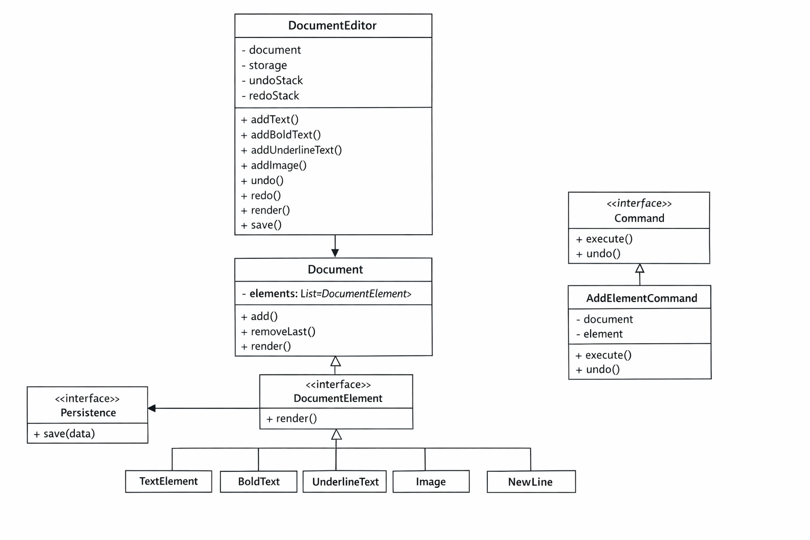

# 📄 Google Docs - Low Level Design (Java + C++)

This project is a simplified implementation of a document editor similar to Google Docs.  
It demonstrates strong Object-Oriented Design and Low-Level Design principles.

---

## 🚀 Features

- Add Text, Image, NewLine, Tab
- Text Formatting:
  - Bold
  - Underline
- Undo / Redo functionality
- Autosave after every operation
- Save document as:
  - Text File
  - PDF (simulated)


---

## UML Diagram (Follow this exactly)

### Dig. in brief

```
[DocumentEditor]
   | uses
   v
[Document] --------> [DocumentElement (interface)]
                         ↑
      -----------------------------------------
      |        |        |        |            |
   [Text]  [Bold]  [Underline] [Image]   [NewLine]

[DocumentEditor] ---> [Command Interface]
                         |
                  [AddElementCommand]

[DocumentEditor] ---> [Persistence Interface]
                         |
                 -------------------
                 |                 |
           [FileStorage]     [PDFStorage]
```


### 📦 Step-by-step layout

👉 Draw boxes in this order (top → bottom)

🔷 1. Top Layer (Controller)
```
+----------------------+
|   DocumentEditor     |
+----------------------+
| - document           |
| - storage            |
| - undoStack          |
| - redoStack          |
+----------------------+
| + addText()          |
| + addBoldText()      |
| + addUnderlineText() |
| + addImage()         |
| + undo()             |
| + redo()             |
| + render()           |
| + save()             |
+----------------------+
```
🔷 2. Middle Layer (Core Model)
```
+----------------------+
|      Document        |
+----------------------+
| - elements : List    |
+----------------------+
| + add()              |
| + removeLast()       |
| + render()           |
+----------------------+
```
🔷 3. Element Abstraction
```
+----------------------+
|  <<interface>>       |
|  DocumentElement     |
+----------------------+
| + render()           |
+----------------------+
```
🔷 4. Element Implementations (Below it)
```
+------------+   +------------+   +------------------+
| TextElement|   | BoldText   |   | UnderlineText    |
+------------+   +------------+   +------------------+

+------------+   +------------+   +------------------+
| Image      |   | NewLine    |   | TabSpace         |
+------------+   +------------+   +------------------+
```
🔷 5. Command Pattern (Side Section)
```
+----------------------+
| <<interface>>        |
| Command              |
+----------------------+
| + execute()          |
| + undo()             |
+----------------------+

        ↓

+----------------------+
| AddElementCommand    |
+----------------------+
| - document           |
| - element            |
+----------------------+
| + execute()          |
| + undo()             |
+----------------------+
```
🔷 6. Storage (Strategy Pattern)
```
+----------------------+
| <<interface>>        |
| Persistence          |
+----------------------+
| + save()             |
+----------------------+

        ↓

+------------------+   +------------------+
| FileStorage      |   | PDFStorage       |
+------------------+   +------------------+
```

🔗 Connections (VERY IMPORTANT)

Draw arrows :

✅ Core flow
DocumentEditor → Document (uses)
Document → DocumentElement (has list)
✅ Inheritance
All elements → DocumentElement
BoldText → TextElement
Underline → TextElement
✅ Command
DocumentEditor → Command
AddElementCommand → Command
✅ Storage
DocumentEditor → Persistence
FileStorage → Persistence
PDFStorage → Persistence

🎨 Final Layout Tip (VERY IMPORTANT)

👉 Arrange on draw.io:

Top:        DocumentEditor

Middle:     Document

Below:      DocumentElement → child elements

Right side: Command Pattern

Left side:  Persistence

---

****************************************************
---

## 🧠 Design Concepts Used

### 1. Abstraction
- `DocumentElement` defines a common interface for all elements

### 2. Polymorphism
- Each element implements its own `render()` method

### 3. Inheritance
- `BoldTextElement`, `UnderlineTextElement` extend `TextElement`

### 4. Composition
- `Document` contains a list of elements

---

## 🎯 Design Patterns

### ✅ Command Pattern
Used for:
- Undo / Redo functionality

Each operation is stored as a command object.

---

### ✅ Strategy Pattern
Used for:
- Storage (File / PDF)

Allows switching storage without changing core logic.

---

### ✅ Open/Closed Principle
- Easily add new elements (e.g., Heading, Italic)
- No modification to existing code required

---

## 🔄 System Flow

User → DocumentEditor → Command → Document → Elements → Render → Storage

---

## 📂 Project Structure
google-doc-editor/
├── README.md
├── java/
│ └── DocumentEditor.java
├── cpp/
│ └── document_editor.cpp
├── diagram.png

---

## 🧪 Sample Output

Hello World
Bold Text
Underline Text
[Image: picture.jpg]

---

## 🔥 Future Improvements

- Cursor-based editing
- Delete / Replace operations
- Real PDF generation (using libraries)
- Collaborative editing (like Google Docs)
- Version control system

---

## 🎯 Why This Project?

This project demonstrates:
- Strong Low-Level Design skills
- Real-world system modeling
- Use of design patterns
- Clean, extensible architecture

---

 
## 📊 LLD Diagram - UML




****************************************
---

## 🧠 SOLID Principles used in this (with Examples)

### 1. Single Responsibility Principle (SRP)
A class should have only one reason to change.

**Example:**
- `Document` → only manages elements
- `FileStorage` → only handles saving

**Use When:**
- You want clean, maintainable code

---

### 2. Open/Closed Principle (OCP)
Open for extension, closed for modification.

**Example:**
- Added `BoldTextElement` without changing existing classes

**Use When:**
- Adding new features frequently

---

### 3. Liskov Substitution Principle (LSP)
Child classes should behave like parent class.

**Example:**
- `BoldTextElement` can replace `TextElement` anywhere

**Use When:**
- Using inheritance

---

### 4. Interface Segregation Principle (ISP)
Don't force classes to implement unused methods.

**Example:**
- `Persistence` only has `save()` (minimal interface)

**Use When:**
- Designing interfaces

---

### 5. Dependency Inversion Principle (DIP)
Depend on abstractions, not concrete classes.

**Example:**
- `DocumentEditor` depends on `Persistence`, not `FileStorage`

**Use When:**
- Writing flexible, testable code

---

## 🎯 Design Patterns (Definition + Example + Use Case)

### 1. Command Pattern
Encapsulates a request as an object.

**Example:**
- `AddElementCommand` → used for undo/redo

**Use When:**
- Need undo/redo or action history

---

### 2. Strategy Pattern
Allows selecting behavior at runtime.

**Example:**
- `FileStorage`, `PDFStorage` implement `Persistence`

**Use When:**
- Multiple interchangeable behaviors (e.g., payment, storage)

---

### 3. Factory Pattern
Creates objects without exposing creation logic.

**Example:**
- Could create elements like `TextElement`, `ImageElement`

**Use When:**
- Object creation logic is complex

---

### 4. Observer Pattern
Notifies multiple objects when state changes.

**Example:**
- Autosave or UI update on document change

**Use When:**
- Event-based systems (notifications, UI updates)

---

### 5. Singleton Pattern
Ensures only one instance exists.

**Example:**
- Logger, Configuration manager

**Use When:**
- Shared global resource needed

****************************************************
---


### 👨‍💻 Author

alpha1zln and learned from coderArmy, Utb and chatGpt.
Built as part of Low-Level Design practice.


***
***********************************


## Explanation 


🧠 First: About System built

👉 You built a mini version of Google Docs

It supports:
Text / Image / Formatting
Undo / Redo
Autosave
File + PDF saving

🔥 FULL FLOW (Understand this first)
User → DocumentEditor → Command → Document → Elements → Render → Storage

👉 This flow is EVERYTHING.
Now we go layer by layer.

🧱 1. DocumentElement (CORE ABSTRACTION)
interface DocumentElement {
    String render();
}

💡 Simple Meaning
👉 “Anything inside document must know how to display itself”


🧠 Why needed?

Without this:
You’d write if-else everywhere ❌
Code becomes messy ❌

With this:
Every element handles itself ✅

🔥 Concept Used
Abstraction
Polymorphism

🧱 2. TextElement
class TextElement implements DocumentElement {
    protected String text;

    public TextElement(String text) {
        this.text = text;
    }

    public String render() {
        return text;
    }
}
🔍 Line by line
protected String text;

👉 Stores content
👉 protected → allows child classes (Bold, Underline) to reuse

Constructor
this.text = text;

👉 Initializes text
render()

👉 Returns plain text

🧱 3. BoldTextElement
class BoldTextElement extends TextElement {
    public BoldTextElement(String text) {
        super(text);
    }

    public String render() {
        return "**" + text + "**";
    }
}

🔍 Important
extends TextElement

👉 Reuse code (Inheritance)
super(text)


👉 Calls parent constructor
render() override

👉 Changes behavior

👉 Same method → different output
→ Polymorphism


🧱 4. UnderlineTextElement
return "__" + text + "__";

👉 Same idea as bold
👉 Just different formatting

🧱 5. ImageElement
class ImageElement implements DocumentElement {
    private String path;

    public ImageElement(String path) {
        this.path = path;
    }

    public String render() {
        return "[Image:" + path + "]";
    }
}
💡 Meaning

👉 Instead of actual image, we simulate it

🧱 6. NewLine & Tab
return "\n";
return "\t";

👉 Represent formatting

🧱 7. Document (VERY IMPORTANT CLASS)
class Document {
    private List<DocumentElement> elements = new ArrayList<>();
💡 Meaning

👉 Document = collection of elements

Add element
public void add(DocumentElement e) {
    elements.add(e);
}

👉 Adds any type (thanks to polymorphism)

Remove last (for undo)
elements.remove(elements.size() - 1);

👉 Removes last operation
Render
for (DocumentElement e : elements)
    sb.append(e.render());

💡 Meaning
👉 Ask each element to render itself
👉 Combine everything


🧠 BIG CONCEPT HERE

👉 You DON’T KNOW type of element
Still works because:
e.render();

👉 That’s runtime polymorphism

💾 8. Persistence (Strategy Pattern)
interface Persistence {
    void save(String data);
}
💡 Why?

👉 You may save:
File
DB
Cloud
FileStorage
FileWriter fw = new FileWriter("document.txt");


👉 Writes to file
PDFStorage
fw.write("PDF_CONTENT:\n" + data);

👉 Simulated PDF


🧠 BIG CONCEPT

👉 You can switch storage WITHOUT changing editor
→ Strategy Pattern

⚔️ 9. Command Pattern (UNDO / REDO)
interface Command {
    void execute();
    void undo();
}

💡 Meaning

👉 Every action = object
AddElementCommand
private Document doc;
private DocumentElement element;


👉 Stores:
what to do
where to do
Execute
doc.add(element);
Undo
doc.removeLast();
🧠 WHY COMMAND PATTERN?


👉 Because:
You can reverse actions
Store history
🎮 10. DocumentEditor (BRAIN)
class DocumentEditor {

👉 Controls everything
Stacks
Stack<Command> undoStack;
Stack<Command> redoStack;

👉 Track history
executeCommand()
cmd.execute();
undoStack.push(cmd);
redoStack.clear();
autoSave();

🔍 Step by step
Execute action
Save in undo stack
Clear redo (new action breaks redo chain)
Autosave

🔄 Undo
Command cmd = undoStack.pop();
cmd.undo();
redoStack.push(cmd);

👉 Move from undo → redo

🔁 Redo
Command cmd = redoStack.pop();
cmd.execute();
undoStack.push(cmd);


👉 Reverse undo

💾 Autosave
storage.save(render());

👉 Saves after every change

🧠 FINAL CONCEPT MAP
Concept	Where Used
Abstraction	DocumentElement, Persistence
Inheritance	BoldText, Underline
Polymorphism	render()
Command Pattern	Undo/Redo
Strategy Pattern	Storage
Composition	Document has elements


🔥 Ivw final explanation
I designed a document editor where content is modeled using a common interface DocumentElement.
Each element implements its own rendering logic using polymorphism.
Undo/Redo is implemented using Command Pattern, where each action is encapsulated as an object.
Persistence is abstracted using Strategy Pattern, allowing flexible storage like file or PDF.
The system is modular, extensible, and follows SOLID principles.

*******************************
aznek1

🚀 What you now have
1. Undo / Redo ✅

👉 Implemented using Command Pattern

Every action = command
Stored in stacks:
undoStack
redoStack
2. Autosave ✅

👉 After every operation:

autoSave();
Saves automatically (like Google Docs)
3. Bold & Underline ✅

New elements:

BoldTextElement → **text**
UnderlineTextElement → __text__
4. PDF Download ✅

👉 Added:

class PDFStorage implements Persistence
You can switch storage anytime:
Persistence pdfStorage = new PDFStorage();
🧠 Important Design Patterns (VERY IMPORTANT FOR YOU)
1. Command Pattern ⭐

Used for:

Undo
Redo

👉 Each action is stored as object

2. Strategy Pattern

Used for:

FileStorage
PDFStorage

👉 interchangeable saving logic

3. Open/Closed Principle

👉 You added:

Bold
Underline
PDF

WITHOUT breaking old code

🧠 How to Explain in Interview (Golden Answer)
This design models a document editor using:

1. Composition → Document contains elements
2. Polymorphism → Each element renders differently
3. Command Pattern → Undo/Redo functionality
4. Strategy Pattern → Different storage mechanisms (File, PDF)
5. Autosave → Improves reliability like real-world editors

System is extensible and follows SOLID principles.


*********************************
*********************************